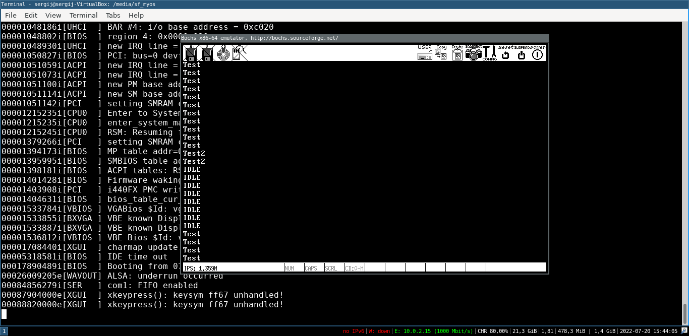

# About
A hobby operation system written in C and assembly. 
You can use source of this project :) 
Here the screnshot: 

# Features
Currently i implement microkernel for this operation system, because it's easily to realize. Yes microkernel slows that monolithic, but it's a my operation system :) 
Current list of features and released components:
- [x] Global description table
- [x] Interrupts
- [x] Memory Management, PMM
- [x] Multitasking
- [ ] Module Loading
- [x] Multiboot structure loading
- [x] User space [in this file](arch/x86/gdtfl.asm)
- [x] Keyboard driver in user space
- [x] Working syscall interface

# How to build?
- Install any cross-compiler
- If you don't use Windows, then replace all '\\' to '/' in Makefile
- Type "make" or if you use Windows, type "mingw32-make"
# Bad news
- The Operation System may didn't support virtual memory and x86_64 CPU
- Doesn't support EFI(GRUB problems)
- Image creation(.iso) available only in linux
# TODO
- Module and user program loading
- Improve the multitasking methods, add support to currently defined but not writen methods in [process.h](inc/process.h)
- More kernel parameters
- Add the VGA support
# Changelog
## Updated Mulitasking
- I added the context switch and combinate the kernel mode tasks and user mode
- Added more tests, like two user mode tasks and one kernel mode task
- I fix the problem with multitasking that i write [here](https://forum.osdev.org/viewtopic.php?f=1&t=56362)  